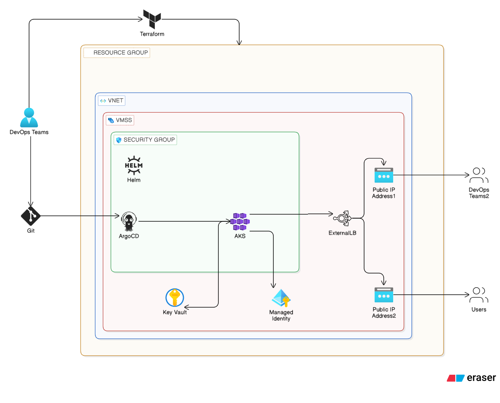
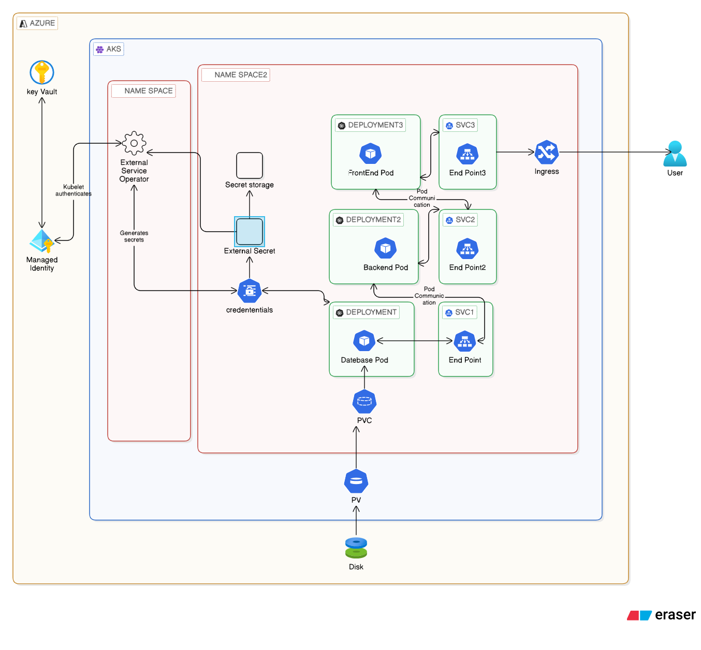

# 🚀 AKS GitOps Deployment — End-to-End Project

**Production-ready deployment of a 3-tier application on Azure Kubernetes Service using GitOps principles with ArgoCD, Terraform, Azure Key Vault, and External Secrets Operator.**

---

## 📋 Table of Contents

- [Architecture Overview](#-architecture-overview)
- [Tech Stack](#-tech-stack)
- [Prerequisites](#-prerequisites)
- [Project Structure](#-project-structure)
- [Infrastructure Setup](#-infrastructure-setup)
- [Cluster & Nodes](#-cluster--nodes)
- [ArgoCD GitOps](#-argocd-gitops)
- [Application Pods](#-application-pods)
- [Key Vault & Secrets](#-key-vault--secrets)
- [External Secrets Operator](#-external-secrets-operator)
- [Networking & Ingress](#-networking--ingress)
- [Resource Usage](#-resource-usage)
- [Health Checks](#-health-checks)
- [Proof Screenshots](#-proof-screenshots)
- [Clean Up](#-clean-up)

---

## 🏗️ Architecture Overview

### Diagram 1 — High-Level GitOps & Infrastructure Flow

Shows the complete CI/CD pipeline from developer commit through Terraform provisioning to live application delivery.



---

### Diagram 2 — Kubernetes Internal Architecture

Shows the internal AKS structure — namespaces, deployments, pods, services, secrets, storage, and ingress for the 3-tier application.



---

## 🛠️ Tech Stack

| Layer | Technology |
|---|---|
| Cloud | Microsoft Azure |
| Infrastructure as Code | Terraform |
| Container Orchestration | Azure Kubernetes Service (AKS) |
| GitOps | ArgoCD |
| Package Management | Helm |
| Secrets Management | Azure Key Vault + External Secrets Operator |
| Database | PostgreSQL 15 |
| Backend | Node.js (port 8080) |
| Frontend | React + Express proxy (port 3000) |
| Ingress | NGINX Ingress Controller |
| State Backend | Azure Storage Account |

---

## ✅ Prerequisites

```bash
# Azure CLI
curl -sL https://aka.ms/InstallAzureCLIDeb | sudo bash

# Terraform
sudo apt update && sudo apt install terraform

# kubectl
curl -LO "https://dl.k8s.io/release/$(curl -Ls https://dl.k8s.io/release/stable.txt)/bin/linux/amd64/kubectl"
sudo install -o root -g root -m 0755 kubectl /usr/local/bin/kubectl

# Helm
curl https://raw.githubusercontent.com/helm/helm/main/scripts/get-helm-3 | bash
```

---

## 📁 Project Structure

```text
.
├── dev/                        # Development environment
│   ├── scripts/
│   │   ├── deploy-argocd-app.sh
│   │   ├── install-external-secrets.sh
│   │   └── cleanup-external-secrets.sh
│   ├── manifests/
│   │   └── argocd-app-manifest.yaml
│   ├── main.tf                 # AKS + Key Vault resources
│   ├── kubernetes-resources.tf # ArgoCD Helm + ArgoCD Application
│   ├── external-secrets.tf     # External Secrets Operator
│   ├── variables.tf
│   ├── outputs.tf
│   ├── provider.tf
│   ├── terraform.tfvars
│   └── backend.tf
├── test/                       # Test environment
├── prod/                       # Production environment
├── manifest-files/
│   └── 3tire-configs/          # Kubernetes manifests (GitOps source)
│       ├── namespace.yaml
│       ├── kustomization.yaml
│       ├── postgres-complete.yaml
│       ├── backend-complete.yaml
│       ├── frontend-complete.yaml
│       ├── key-vault-secrets.yaml
│       └── external-secrets-placeholder.yaml
└── README.md
```

---

## 🏗️ Infrastructure Setup

### Deploy with Terraform

```bash
cd dev/
terraform init
terraform plan
terraform apply -auto-approve
```

### Verify Terraform State & Outputs

```bash
# List all managed resources
terraform state list

# Show all output values (Key Vault name, AKS name, kubelet identity, etc.)
terraform output
```

> **After `terraform apply` completes successfully:**


### Azure Resource Group

```bash
az group list -o table
```

### AKS Cluster Info

```bash
az aks list -o table

az aks show \
  --resource-group aks-gitops-rg-dev \
  --name aks-gitops-cluster-dev \
  -o table
```


---

## ☸️ Cluster & Nodes

```bash
# Cluster API server endpoint
kubectl cluster-info

# Node status
kubectl get nodes
kubectl get nodes -o wide

# All namespaces
kubectl get namespaces

# Everything across all namespaces
kubectl get all -A
```


> All nodes show `STATUS: Ready`. The dev cluster runs auto-scaling (min 1, max 5 nodes).

---

## 🚀 ArgoCD GitOps

ArgoCD is installed via Helm by Terraform and continuously syncs the 3-tier application from the Git repository.

```bash
# ArgoCD pods
kubectl get pods -n argocd

# ArgoCD services — note the LoadBalancer EXTERNAL-IP
kubectl get svc -n argocd

# All managed applications and their sync status
kubectl get applications -n argocd

# Retrieve the ArgoCD admin password
kubectl -n argocd get secret argocd-initial-admin-secret \
  -o jsonpath="{.data.password}" | base64 -d && echo
```


> Access the ArgoCD UI at the external LoadBalancer IP shown above.
> Login: `admin` / password from the command above.
>
> The application `3tirewebapp-dev` shows **Synced** and **Healthy** — GitOps is working correctly.

### Sync Policy (from `argocd-app-manifest.yaml`)

```yaml
syncPolicy:
  automated:
    prune: true      # removes resources deleted from Git
    selfHeal: true   # reverts any manual cluster changes
  syncOptions:
    - CreateNamespace=true
    - ApplyOutOfSyncOnly=true
  retry:
    limit: 5
    backoff:
      duration: 5s
      factor: 2
      maxDuration: 3m
```

---

## 📦 Application Pods

The 3-tier application runs entirely in the `3tirewebapp-dev` namespace, managed by ArgoCD.

```bash
# All resources in the app namespace
kubectl get all -n 3tirewebapp-dev

# Pod status
kubectl get pods -n 3tirewebapp-dev
kubectl get pods -n 3tirewebapp-dev -o wide

# Services and cluster/external IPs
kubectl get svc -n 3tirewebapp-dev

# Deployments and replica counts
kubectl get deployments -n 3tirewebapp-dev
```


> All pods show `STATUS: Running`. Postgres uses `Recreate` strategy (required for `ReadWriteOnce` PVC). Frontend and backend scale to 2 replicas as defined in `kustomization.yaml`.

### Application Components

| Component | Image | Port | Replicas | Strategy |
|---|---|---|---|---|
| Frontend | `jpatel6625/frontend:latest` | 3000 | 2 | RollingUpdate |
| Backend | `jpatel6625/backend:latest` | 8080 | 2 | RollingUpdate |
| PostgreSQL | `postgres:15` | 5432 | 1 | Recreate |

---

## 🔐 Key Vault & Secrets

Azure Key Vault stores all database credentials. The vault name is dynamically generated by Terraform (`kv-dev-<random-suffix>`).

```bash
# List all Key Vaults in the subscription
az keyvault list -o table

# List secrets stored in the vault
az keyvault secret list --vault-name kv-dev-ks1s3mip -o table

# Kubernetes secrets in the app namespace
kubectl get secrets -n 3tirewebapp-dev

# SecretProviderClass (CSI driver configuration)
kubectl get secretproviderclass -n 3tirewebapp-dev
```


> **4 secrets stored in Key Vault:**
>
> | Secret Name | Purpose |
> |---|---|
> | `postgres-username` | Database username |
> | `postgres-password` | Database password |
> | `postgres-database` | Database name (`goalsdb`) |
> | `postgres-connection-string` | Full PostgreSQL URI |

---

## 🔒 External Secrets Operator

The External Secrets Operator (ESO) runs in the `external-secrets-system` namespace. It authenticates to Azure Key Vault via Managed Identity and syncs secrets into Kubernetes every 1 minute.

```bash
# ESO controller pods
kubectl get pods -n external-secrets-system

# SecretStore — Key Vault connection config
kubectl get secretstore -n 3tirewebapp-dev

# ExternalSecret — secret sync mapping
kubectl get externalsecret -n 3tirewebapp-dev

# Detailed sync status and last refresh time
kubectl describe externalsecret postgres-credentials -n 3tirewebapp-dev
```

> **Expected:** `SecretSynced` condition with `Ready: True`. The resulting Kubernetes secret `postgres-credentials-from-kv` is mounted into Postgres and Backend pods as environment variables.

### ESO Secret Flow

```
Azure Key Vault
      ↓  ESO authenticates via Managed Identity (kubelet identity)
ExternalSecret (postgres-credentials)
      ↓  syncs every 1 minute
postgres-credentials-from-kv  (Kubernetes Secret, Opaque)
      ↓  injected as environment variables
Postgres Pod          Backend Pod
POSTGRES_USER         DB_USERNAME
POSTGRES_PASSWORD     DB_PASSWORD
POSTGRES_DB           DB_NAME
```

---

## 🌐 Networking & Ingress

```bash
# All LoadBalancer services across the cluster
kubectl get svc -A | grep LoadBalancer

# Ingress rules for the app namespace
kubectl get ingress -n 3tirewebapp-dev

# All public IPs allocated in Azure
az network public-ip list -o table
```

> Two LoadBalancer IPs are provisioned:
> - **Public IP 1** — ArgoCD server (DevOps management access)
> - **Public IP 2** — Frontend application (end-user access, port 3000)

### Access the Application

```bash
# Get frontend external IP
FRONTEND_IP=$(kubectl get svc frontend -n 3tirewebapp-dev \
  -o jsonpath='{.status.loadBalancer.ingress[0].ip}')
echo "App URL: http://$FRONTEND_IP:3000"

# Verify the app responds
curl http://$FRONTEND_IP:3000
```

---

## 📊 Resource Usage

```bash
# CPU and memory per node
kubectl top nodes

# CPU and memory per pod — app namespace
kubectl top pods -n 3tirewebapp-dev

# CPU and memory — ArgoCD namespace
kubectl top pods -n argocd
```


### Resource Limits (from manifest files)

| Pod | CPU Request | CPU Limit | Mem Request | Mem Limit |
|---|---|---|---|---|
| Frontend | 100m | 200m | 128Mi | 256Mi |
| Backend | 100m | 200m | 128Mi | 256Mi |
| PostgreSQL | 100m | 200m | 256Mi | 512Mi |

---

## 🏥 Health Checks

```bash
# Application logs — last 20 lines each
kubectl logs deployment/frontend  -n 3tirewebapp-dev --tail=20
kubectl logs deployment/backend   -n 3tirewebapp-dev --tail=20
kubectl logs deployment/postgres  -n 3tirewebapp-dev --tail=20

# Full pod details — events, mounts, env vars
kubectl describe pods -n 3tirewebapp-dev

# Recent events sorted by timestamp
kubectl get events -n 3tirewebapp-dev --sort-by='.lastTimestamp'
```

### Internal Connectivity Tests

```bash
# Test backend health endpoint from inside cluster
kubectl run debug --image=curlimages/curl --rm -it --restart=Never -- \
  curl -s http://backend.3tirewebapp-dev.svc.cluster.local:8080/health

# Test frontend from inside cluster
kubectl run debug --image=curlimages/curl --rm -it --restart=Never -- \
  curl -s http://frontend.3tirewebapp-dev.svc.cluster.local:3000

# Test database connectivity from backend pod
kubectl exec -it deployment/backend -n 3tirewebapp-dev -- \
  nc -z postgres 5432 && echo "DB reachable" || echo "DB unreachable"
```

---

## 🎯 Proof Screenshots

Complete evidence of a working end-to-end deployment.

### 1. Terraform provisioning complete

```bash
terraform output
```


---

### 2. AKS cluster created — nodes ready

```bash
kubectl get nodes
```


---

### 3. All namespaces active

```bash
kubectl get namespaces
```


---

### 4. AKS cluster details verified

```bash
az aks show --resource-group aks-gitops-rg-dev --name aks-gitops-cluster-dev -o table
```


---

### 5. Resource group contents

```bash
az group list -o table
```


---

### 6. AKS network and identity info

```bash
az aks show --resource-group aks-gitops-rg-dev --name aks-gitops-cluster-dev -o table
```


---

### 7. All cluster nodes ready

```bash
kubectl get nodes -o wide
```


---

### 8. ArgoCD running and application synced

```bash
kubectl get pods -n argocd
kubectl get applications -n argocd
```


---

### 9. All application pods running

```bash
kubectl get pods -n 3tirewebapp-dev
kubectl get svc -n 3tirewebapp-dev
```


---

### 10. Key Vault secrets confirmed

```bash
az keyvault secret list --vault-name kv-dev-ks1s3mip -o table
kubectl get secrets -n 3tirewebapp-dev
```


---

### 11. Resource usage within limits

```bash
kubectl top nodes
kubectl top pods -n 3tirewebapp-dev
```


---

### 12. Application live and responding

```bash
curl http://20.204.248.10:3000
```

> Application responds successfully — 3-tier web app (React frontend → Node.js backend → PostgreSQL) is fully operational.

---

## 🧹 Clean Up

```bash
# 1. Remove ArgoCD applications
kubectl delete applications --all -n argocd

# 2. Destroy all Azure infrastructure
cd dev/
terraform destroy -auto-approve

# 3. Clean up local kubectl context
kubectl config delete-context <cluster-context>

# 4. Clean up kubeconfig backup
rm -f ~/.kube/config.backup
```

> **Key Vault note:** Soft delete is enabled with a 7-day retention. If you redeploy within that window, Terraform automatically recovers the vault (`recover_soft_deleted_key_vaults = true` in `provider.tf`).

---

## 📝 Key Files Reference

| File | Purpose |
|---|---|
| `dev/main.tf` | AKS cluster + Key Vault + database secrets |
| `dev/kubernetes-resources.tf` | ArgoCD Helm release + ArgoCD Application resource |
| `dev/external-secrets.tf` | External Secrets Operator installation via script |
| `dev/provider.tf` | AzureRM, Helm, Kubernetes, Time providers |
| `dev/terraform.tfvars` | All environment-specific variable values |
| `dev/backend.tf` | Remote state backend (Azure Storage) |
| `manifest-files/3tire-configs/kustomization.yaml` | Image tags + replica counts for all deployments |
| `manifest-files/3tire-configs/postgres-complete.yaml` | PostgreSQL deployment, service, PVC |
| `manifest-files/3tire-configs/backend-complete.yaml` | Backend deployment + service |
| `manifest-files/3tire-configs/frontend-complete.yaml` | Frontend deployment, service, ingress |
| `manifest-files/3tire-configs/key-vault-secrets.yaml` | SecretProviderClass for CSI driver |
| `manifest-files/3tire-configs/external-secrets-placeholder.yaml` | ESO ConfigMap placeholder for ArgoCD |

---

**🎉 End-to-end AKS GitOps deployment — infrastructure as code with Terraform, continuous delivery with ArgoCD, and zero-secret-in-Git via Azure Key Vault and External Secrets Operator.**